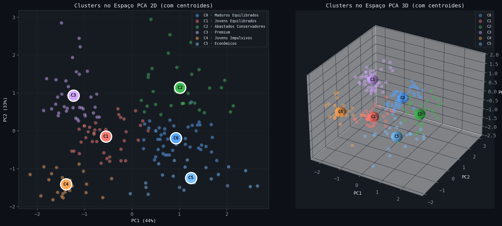
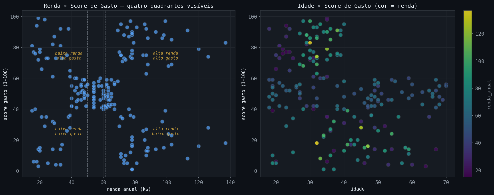
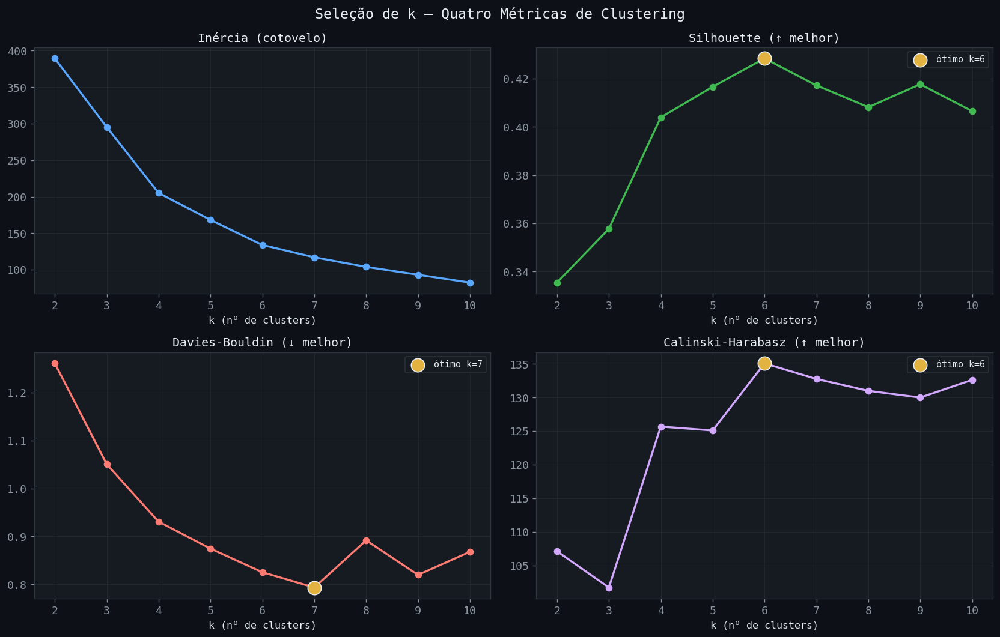
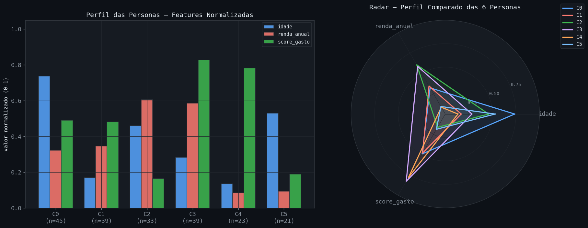
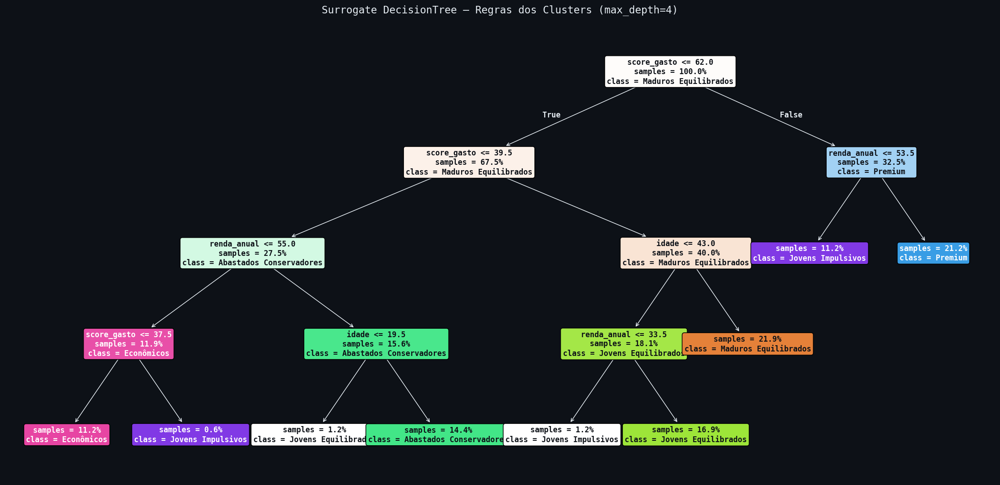

# 🛍️ Segmentação de Clientes — Mall Customers

> Clustering não supervisionado de clientes de shopping em **6 personas acionáveis**, usando um **Pipeline scikit-learn** (`StandardScaler → KMeans`) como artefato único de deploy, com PCA para visualização e uma DecisionTree *surrogate* para interpretabilidade.


---

## 📌 Visão geral

Este projeto segmenta **200 clientes** de um shopping a partir de três variáveis — idade, renda anual e score de gasto — em grupos de comportamento distintos e interpretáveis. Em vez do fluxo manual (`LabelEncoder` + `get_dummies` + scaler avulso), toda a transformação vive dentro de um `Pipeline` do scikit-learn: o artefato final recebe dados crus e devolve a persona do cliente em **uma única chamada**, pronto para produção.

A abordagem prioriza decisões justificadas por evidência: cada escolha de método (excluir gênero, número de clusters, papel do PCA) é ancorada em testes estatísticos e métricas de validação documentadas ao longo de seis notebooks.

🔗 **[Acessar App no Streamlit Cloud](https://customer-segmentation-mall-kpgewlzwwzohpjny3dpuer.streamlit.app/)**

---

## 🎯 Resultados principais

Seis personas emergiram da análise, todas com perfil de negócio claro:

| Persona | Clientes | Idade média | Renda média (k$) | Gasto médio | Leitura de negócio |
|---|:---:|:---:|:---:|:---:|---|
| **Maduros Equilibrados** | 45 | 56 | 54 | 49 | Base estável e fiel |
| **Jovens Equilibrados** | 39 | 27 | 57 | 48 | Potencial de crescimento |
| **Premium** | 39 | 33 | 87 | 82 | Clientes-ouro — foco de retenção |
| **Abastados Conservadores** | 33 | 42 | 89 | 17 | Alto poder, baixa conversão |
| **Jovens Impulsivos** | 23 | 25 | 25 | 78 | Sensíveis a tendência/promoção |
| **Econômicos** | 21 | 46 | 26 | 19 | Consumo contido — atrair por valor |

**Métricas de validação (k=6):** Silhouette `0.428` · Davies-Bouldin `0.825` · Calinski-Harabasz `135.1` · Fidelidade do surrogate `92.5%` (teste).



---

## 🔬 Metodologia

O projeto está organizado em **seis notebooks**, do dado bruto ao artefato de deploy.

### 1. EDA + análise estatística (`01_eda`)
- **Normalidade (Shapiro-Wilk):** as três variáveis rejeitam normalidade → testes não-paramétricos.
- **Correlação (Spearman):** renda × gasto ≈ 0 e idade × renda ≈ 0 → **features independentes** (pouca redundância).
- **Tendência de clusterização (Hopkins):** `H = 0.70` → estrutura de agrupamento real, segmentação justificável.
- **Diferença por gênero (Mann-Whitney U):** gênero **não** diferencia nenhuma variável (p > 0.41) → decisão de excluí-lo do clustering, validada empiricamente.



### 2. Limpeza (`02_limpeza`)
Dados já íntegros (zero nulos/duplicatas). `id_cliente` movido para índice (rastreável, fora das features).

### 3. Feature Engineering (`03_feature_engineering`)
- **Preprocessor (`ColumnTransformer`):** `StandardScaler` nas numéricas; `genero` descartado via `remainder='drop'`.
- **Decisão sobre PCA:** variância distribuída de forma uniforme (44% / 33% / 22%) — features independentes não pedem redução. **PCA reservado para visualização**, não entra no clustering.

### 4. Modelagem (`04_modelagem`)
Seleção de `k` por quatro métricas (cotovelo, Silhouette, Davies-Bouldin, Calinski-Harabasz) → **k=6**. Pipeline final fitado no dataset completo.



### 5. Avaliação (`05_avaliacao`)
- Perfilização das 6 personas e cruzamento persona × gênero (qui-quadrado `p=0.558` confirma independência).
- **Surrogate DecisionTree:** aprende regras legíveis que reproduzem as fronteiras do KMeans com 92.5% de fidelidade. O surrogate redescobriu de forma independente que a **idade** separa Maduros de Jovens Equilibrados — confirmando a escolha de k=6.




### 6. Exportação (`06_exportacao`)
Geração dos artefatos de deploy, relatório HTML autossuficiente e checagem de integridade ponta a ponta.

---

## 🗂️ Estrutura do projeto

```
customer_segmentation_mall/
├── app/                      # aplicação Streamlit (em refatoração para o pipeline novo)
│   ├── main.py
│   ├── style.py
│   └── pages/
│       ├── 1_visao_geral.py
│       ├── 2_clusters.py
│       └── 3_classificar.py
├── configs/
│   └── config.yaml           # caminhos e parâmetros centralizados
├── data/
│   ├── raw/                  # Mall_Customers.csv (no .gitignore)
│   └── processed/            # parquets intermediários e features.parquet
├── models/
│   ├── pipeline_final.joblib # ARTEFATO ÚNICO de deploy (preprocessor → KMeans)
│   ├── personas.json         # dicionário cluster → {nome, descrição}
│   ├── preprocessor.pkl      # referência/inspeção
│   └── pca_visualizacao.pkl  # projeção para os gráficos do app
├── notebooks/                # 01_eda … 06_exportacao
├── reports/
│   ├── figures/              # figuras (.png)
│   └── relatorio_final.html  # relatório consolidado (figuras embutidas)
├── src/
│   ├── config.py             # carrega configs/config.yaml
│   ├── data.py               # padronizar_colunas() — nomes em snake_case PT-BR
│   ├── report.py             # RelatorioHTML — gerador de relatório reutilizável
│   └── viz_config.py         # tema GitHub Dark centralizado
├── tests/
├── setup.py
└── README.md
```

---

## 🚀 Como rodar

### Pré-requisitos
- Anaconda/Miniconda
- Python 3.11

### Setup do ambiente

```bash
# clonar o repositório
git clone https://github.com/jhastoledo/customer_segmentation_mall.git
cd customer_segmentation_mall

# criar e ativar o ambiente conda
conda create -n singularity python=3.11 -y
conda activate singularity

# instalar o projeto como pacote editável (habilita os imports de src/)
pip install -e .
```

### Reproduzir a análise
Execute os notebooks em ordem (`notebooks/01_eda.ipynb` → `06_exportacao.ipynb`). Cada notebook é auto-contido e recarrega seus insumos do disco, gerando os artefatos consumidos pelo seguinte.

### Usar o modelo treinado

```python
import joblib, json, pandas as pd

pipeline = joblib.load("models/pipeline_final.joblib")
personas = json.load(open("models/personas.json", encoding="utf-8"))

cliente = pd.DataFrame([{
    "genero": "Female", "idade": 30, "renda_anual": 90, "score_gasto": 85
}])

cluster = int(pipeline.predict(cliente)[0])
print(personas[str(cluster)]["nome"])   # → "Premium"
```

---

## 🌐 App Streamlit e deploy

> ⚠️ **Em refatoração.** A aplicação em `app/` ainda reflete a versão manual anterior e está sendo adaptada para consumir o `pipeline_final.joblib` e o `features.parquet` gerados pelo novo fluxo. As instruções abaixo valem para a versão refatorada.

### Rodar localmente

```bash
conda activate singularity
streamlit run app/main.py
```

### Deploy no Streamlit Cloud
O projeto está **deploy-ready**:
1. Faça push do repositório para o GitHub.
2. Em [share.streamlit.io](https://share.streamlit.io), conecte o repositório.
3. Aponte o arquivo principal para `app/main.py`.
4. Garanta que os artefatos de `models/` e `data/processed/features.parquet` estejam versionados (ou ajuste o `.gitignore`).

---

## 🧰 Stack

`Python` · `pandas` · `scikit-learn` · `scipy` · `matplotlib` · `seaborn` · `joblib` · `Streamlit` · `JupyterLab` · `conda`

---

## 📖 Dicionário de dados

Fonte: [Mall Customer Segmentation Data](https://www.kaggle.com/datasets/vjchoudhary7/customer-segmentation-tutorial-in-python) (Kaggle).

| Coluna (projeto) | Original | Tipo | Descrição |
|---|---|---|---|
| `id_cliente` | CustomerID | int (índice) | Identificador único do cliente |
| `genero` | Gender | categórica | `Male` / `Female` (usado só na perfilização) |
| `idade` | Age | int | Idade em anos |
| `renda_anual` | Annual Income (k$) | int | Renda anual em milhares de dólares |
| `score_gasto` | Spending Score (1-100) | int | Score de gasto atribuído pelo shopping (1–100) |
| `cluster` | — | int | Rótulo do cluster (0–5), gerado pelo modelo |
| `persona` | — | categórica | Nome de negócio da persona, derivado do cluster |

---

## 👤 Autor

**Jhonnes Toledo** — [github.com/jhastoledo](https://github.com/jhastoledo)

Projeto de portfólio em Ciência de Dados, parte de uma série refatorada para a abordagem Pipeline (sklearn).
